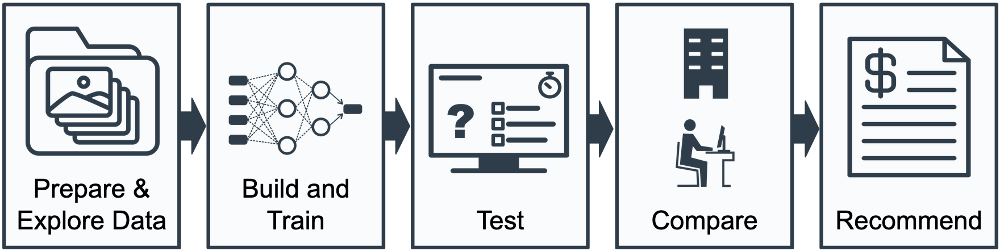

# CIFAR-10_Image_Classifier

Part of the Udacity Introduction to Machine Learning with PyTorch capstone project

In this project, you'll demonstrate the skills you’ve developed in this course by building an image classifier and object detection system using PyTorch. To do this project, you'll need to pull together the new deep learning skills you've just learned, such as data augmentation and building neural networks in order to solve the problem presented in the scenario below.

The following are the main steps of this project. The notebook also contains instructions and hints that will guide you through this process:

    Explore and prepare the data for training and testing.
    Design and build your neural network.
    Train the neural network on the training set.
    Evaluate your network's performance on the test set.
    Make a recommendation on the build vs. buy business decision.

